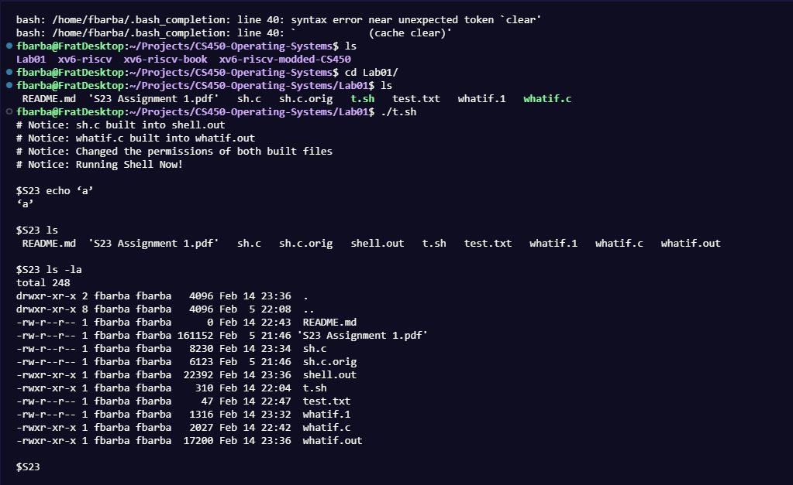
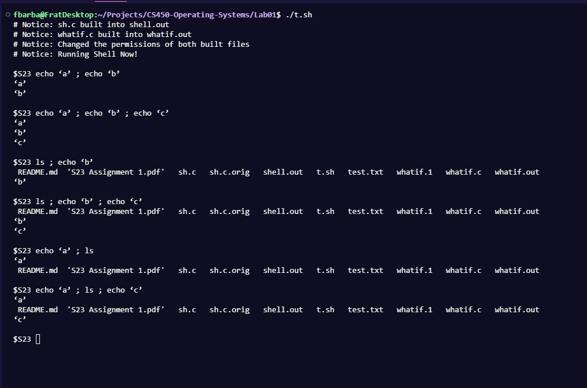
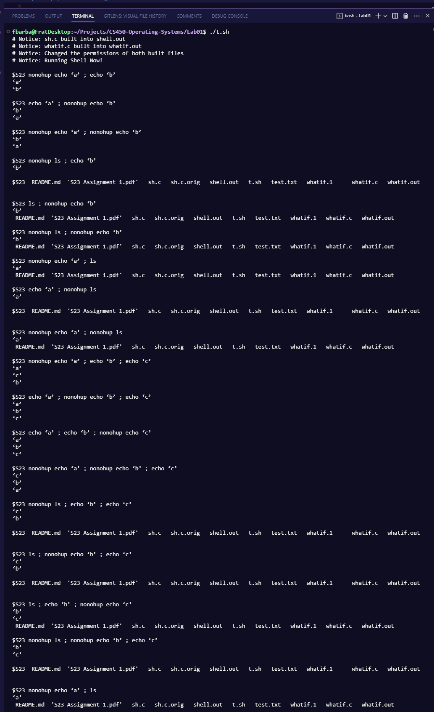
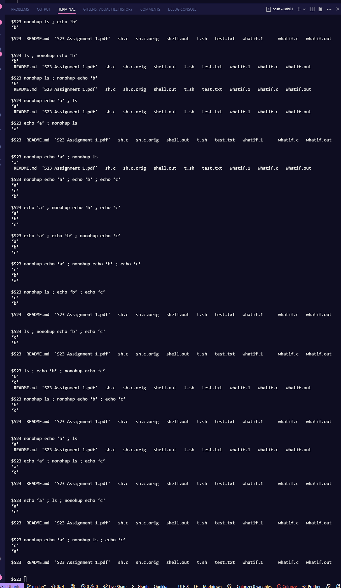
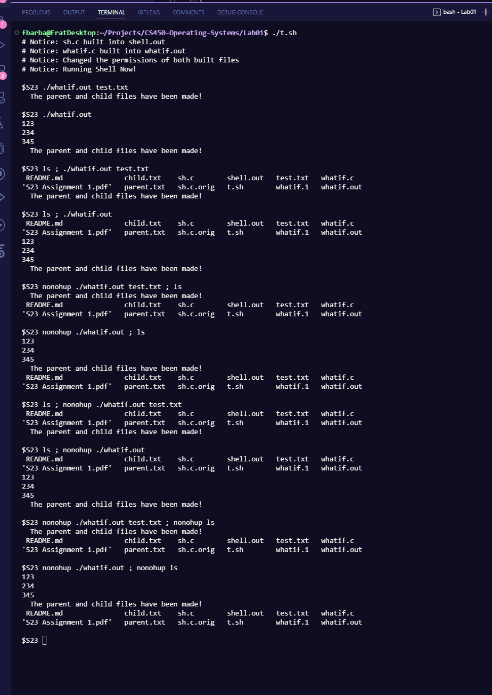
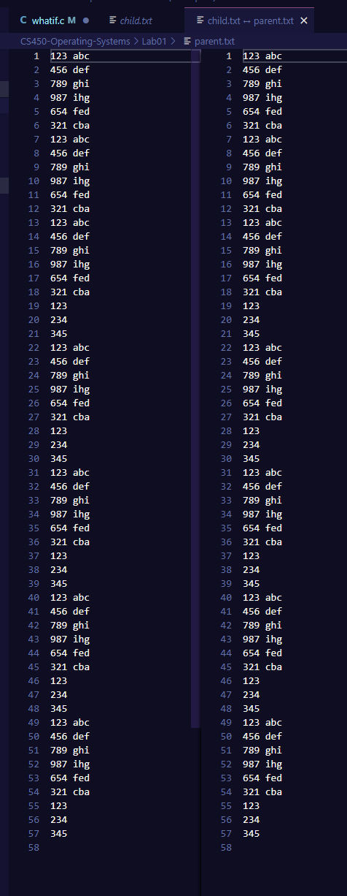

# LAB 1

# README

---

# DELIVERABLE #1: Building

## Initial Setup:

<aside>
💡 You will want to install the gcc complier and the qemu programs. This can be done by running the commands below for you linux terminal. Personally I used WSL (Windows Subsystem for linux) for this project.

</aside>

```bash
$ sudo apt-get update && sudo apt-get upgrade
$ sudo apt-get install git build-essential gdb-multiarch qemu-system-misc gcc-riscv64-linux-gnu binutils-riscv64-linux-gnu
```

<aside>
💡 I usually find running the first set of commands again will yield more updates.

You can check that Make, Qemu, and GCC are working correctly by trying the following commands:

</aside>

```bash
# in the xv6 directory
$ make qemu
# ... lots of output ...
init: starting sh
$
```

<aside>
💡 If that doesn't work, you can double check individual components. Which include QEMU:

</aside>

```bash
$ qemu-system-riscv64 --version
QEMU emulator version 5.1.0

```

<aside>
💡 And at least one RISC-V version of GCC:

</aside>

```bash
$ riscv64-linux-gnu-gcc --version
					riscv64-linux-gnu-gcc (Debian 10.3.0-8) 10.3.0
OR...
$ riscv64-unknown-elf-gcc --version
					riscv64-unknown-elf-gcc (GCC) 10.1.0
OR...
$ riscv64-unknown-linux-gnu-gcc --version
					riscv64-unknown-linux-gnu-gcc (GCC) 10.1.0
```

## Building and executing Programming Assignment #1:

<aside>
💡 To start you will want to navigate to the folder containing the Programming Assignment Files. for me this looks like:

          ”fbarba@FratDesktop:~/Projects/CS450-Operating-Systems/Lab01$”

In that folder you will find “./t.sh” this is a script that will run and execute build commands.

</aside>

```bash
# in the PA1 folder
~/Lab01$ ./t.sh

# Notice: sh.c built into shell.out
# Notice: whatif.c built into whatif.out
# Notice: Changed the permissions of both built files
# Notice: Running Shell Now!

 $S23
```

```powershell
gcc ./sh.c -o "./shell.out"
echo "# Notice: sh.c built into shell.out"

gcc ./whatif.c -o "./whatif.out"
echo "# Notice: whatif.c built into whatif.out"

chmod +wrx ./shell.out
chmod +wrx ./whatif.out
echo "# Notice: Changed the permissions of both built files"

echo "# Notice: Running Shell Now!"
./shell.out
```

<aside>
💡 This script creates 2 files "shell.out" & "whatif.out" and it changes the files permissions

- "shell.out" is our actual shell program and we can enter it by just calling it in the terminal: "./shell.out"
- "whatif.out" is our created program and we can start the program just by calling it in the shell: "./whatif.out"
- the “*.out” files have their permissions changed so that we can run them each time they are created with no extra problems.
</aside>

# DELIVERABLE #2: Code Modification

## sh.c Modifications:

```c
#include <sys/wait.h>  // wait was added as it was missing
```

```c
struct bothcmd{      //created this struct to handle the type ";"
  int type;          // ;
  struct cmd *left;  // left side of the ; argument
  struct cmd *right; // right side of the ; argument
};
```

```c
void runcmd(struct cmd *cmd) {
...
struct bothcmd *bcmd; //added to provide runcmd with access to the newly created struct. Pointing to a unique pointer for this cmd run.
...
}
```

```c
	case ' ':
		ecmd = (struct execcmd *)cmd;     //execcmd is initially called here
		if (ecmd->argv[0] == 0){          //if this CMD has no commands then the shell will ex
			exit(0);                        //exit called if the if statement is TRUE
		}

		else if (strcmp(ecmd->argv[0], "nonohup") == 0){  //this uses strcmp to check if the first value in the CMD args array is nonohup
			if (fork1() == 0){                              //if it is then the shell will create a fork here and the child will run.
				execvp(ecmd->argv[1], &(ecmd->argv[1]));      //this sends through the command using the execvp command
			}
			wait(0);                                        //the child is asked to wait for the parent here
		}
		else{                                             //else any command is executed normally
			execvp(ecmd->argv[0], ecmd->argv);              //here the normal non nonohup command is sent through
			printf("exec %s failed\n", ecmd->argv[0]);      //this will print if the previous command fails
		}
		break;                                            //The case breaks here
```

```c
	case ';':
		bcmd = (struct listcmd*)cmd;     //execcmd is initially called here
		if(fork1() == 0){                //This creates a fork and the left side of the command is run
			runcmd(bcmd->left);            //The left side is run
		}
		runcmd(bcmd->right);             //The right side is run
		break;                           //The case breaks here
```

```c
fprintf(stdout, "$S23 \n"); // added S23 to the shell indicator of $ to $S23
```

```c
struct cmd *                                          //this is a struct for the cmd under the type ";"
bothcmd(struct cmd *left, struct cmd *right){
  struct bothcmd *cmd;

  cmd = malloc(sizeof(*cmd));
  memset(cmd, 0, sizeof(*cmd));
  cmd->type = ';';
  cmd->left = left;
  cmd->right = right;
  return (struct cmd*)cmd;
}
```

```c
char symbols[] = "<|>;";   // ";" needs to be added to this parsing symbol array.
```

```c
case ';':               // this was added to check for the case of ";" of get token and add a counter to the gettocken function
	s++;
	break;
```

```c
if(peek(ps, es, ";")){                        //added to parseline to get it to check for ";" within the parsepipe function
    gettoken(ps, es, 0, 0);
    cmd = bothcmd(cmd, parseline(ps, es));
  }
```

```c
while (!peek(ps, es, "|;")){   //added this to parseexec to make sure the function peek() checks for the new symbol
```

## whatif.c Creation:

```c
#include <stdlib.h>
#include <unistd.h>
#include <stdio.h>
#include <fcntl.h>
#include <string.h>
#include <assert.h>
#include <sys/types.h>
#include <sys/stat.h>
#include <sys/wait.h>
#include <sys/fcntl.h>

int main(int argc, char *argv[]){
  int fd = 0; // init the file discriptor to zero
  if (argc == 2){ // Check for input from file argument
    fd = open(argv[1], O_RDONLY); // open the file in a read only format
    if (fd < 0){ // check if there is a issue opening the file
      fprintf(stderr, "File %s does not exist\n", argv[1]); //print error msg about opening the file
      exit(1); //exit as a failure
    }
  }

  int chld = open("child.txt", O_CREAT | O_WRONLY | O_TRUNC, 0644);  // Create child.txt file in write only permissions and trunc old file
  int prnt = open("parent.txt", O_CREAT | O_WRONLY | O_TRUNC, 0644); // Create parent.txt file in write only permissions and trunc old file
  if (chld < 0 || prnt < 0){ // check if either file has a issue opening
    perror("Failed to create output files"); // flag error
    exit(1); //exit as a failure
  }

  char buf[512]; // buffer to hold chars
  while (fgets(buf, sizeof(buf), fd != 0 ? fdopen(fd, "r") : stdin) != NULL){ // read input from user or from file and store in buffer
    pid_t pid = fork(); // Create a child
    if (pid < 0){ // check if child creation failed
      perror("Failed to fork process"); // flag error
      exit(1); //exit as a failure
    }
    else if (pid == 0){ // is this the child program
      // Child
      write(chld, buf, strlen(buf)); // write from the buffer to the child file 
      exit(0); //exit child with success
    }
    else{
      // Parent
      write(prnt, buf, strlen(buf)); // write from the buffer to the parent file 
      wait(NULL); //wait for child to finish 
    }
  }

  close(chld); // close child file
  close(prnt); // close parent file
  if (fd > 0){ // if and input file was oppened then close it
    close(fd); // close the input file
  }
  exit(0); //exit the program with success
}
```

# DELIVERABLE #3: whatif Behavior

## Behavior:

See this program for a simple illustration of process branching and inter-process communication to write to two different output files. The program starts with some header files  required for later functions. The next step in the main() function is to set the file descriptor variable to zero. The open() system call is used to try to open a file when the program is called with command line arguments. Standard error receives an error message, and  if the file cannot be opened, the program exits with an error status.

Using the open() system call, the program creates two new files, "child.txt" and "parent.txt". With permissions 0644, these files are opened in write-only mode and existing data  is deleted. If either file cannot be created, you receive an error message on standard error and the program exits with an error status. After the output file is created, the program  enters a while loop to read input data from previously opened files or standard input. The fgets() function is used to read data into a buffer. The fgets() function reads until it encounters a newline, end of file, or sizeof(buf) character. The loop continues until there is no more input data to read. Using the fork() system call, the program starts a new child process for each input line. By duplicating the calling process, the fork() system call starts a new process.

The original process is called the parent process and the new process is called the child process. Using the write() system call, the program writes the data from the buffer to the child.txt file  and  exits the child process with  success status. The program uses the write() system call in the parent process to write data from the buffer to the parent.txt file. Then use the wait() system call in the child process to wait for the child process to exit. Forking a new child process, writing to the output file, and waiting for the child process to complete are all steps that the parent process performs after the child process exits. The parent process then proceeds to the next input line. The program closes the output file after processing all input data. It also closes the input file if it is open. The program then exits with a success status. I believe that the expectation was for the program to have issues reading the same lines from each other to avoid this error and issue I used a char buffer. In general, this program demonstrates how to use  multiple processes and inter-process communication to write data to two different output files. Child processes are created using the fork() system call, and both  parent and child processes communicate using file descriptors to write to the appropriate files.

# DELIVERABLE #4: Test data sets

## Test Sets:

<aside>
💡 These are a good set of testing measures because I am using 3 cases and also each case has a slightly longer process time than the last and this will com in handy for testing “;” cases. These cases will be structured out by the main ones and then the moddified version of the test.

</aside>

1. Check if the implementation of exec is working
    1. echo ‘a’
    2. ls
    3. ls -la
2. Check if the implementation of “;”
    1. echo ‘a’ ; echo ‘b’
        1. echo ‘a’ ; echo ‘b’ ; echo ‘c’
    2. ls ; echo ‘b’
        1. ls ; echo ‘b’ ; echo ‘c’
    3. echo ‘a’ ; ls
        1. echo ‘a’ ; ls ; echo ‘c’
3. Check the implementation of nonohup
    1. nonohup echo ‘a’ ; echo ‘b’
        1. echo ‘a’ ; nonohup echo ‘b’
        2. nonohup echo ‘a’ ; nonohup echo ‘b’
    2. nonohup ls ; echo ‘b’
        1. ls ; nonohup echo ‘b’
        2. nonohup ls ; nonohup echo ‘b’
    3. nonohup echo ‘a’ ; ls
        1. echo ‘a’ ; nonohup ls
        2. nonohup echo ‘a’ ; nonohup ls
    4. nonohup echo ‘a’ ; echo ‘b’ ; echo ‘c’
        1. echo ‘a’ ; nonohup echo ‘b’ ; echo ‘c’
        2. echo ‘a’ ; echo ‘b’ ; nonohup echo ‘c’
        3. nonohup echo ‘a’ ; nonohup echo ‘b’ ; echo ‘c’
    5. nonohup ls ; echo ‘b’ ; echo ‘c’
        1. ls ; nonohup echo ‘b’ ; echo ‘c’
        2. ls ; echo ‘b’ ; nonohup echo ‘c’
        3. nonohup ls ; nonohup echo ‘b’ ; echo ‘c’
    6. nonohup echo ‘a’ ; ls
        1. echo ‘a’ ; nonohup ls ; echo ‘c’
        2. echo ‘a’ ; ls ; nonohup echo ‘c’
        3. nonohup echo ‘a’ ; nonohup ls ; echo ‘c’
4. Check the implementation of whatif.c along with nonohup
    1. ./whatif.out test.txt
        1. ls ; ./whatif.out test.txt
        2. nonohup ./whatif.out test.txt ; ls
        3. ls ; nonohup ./whatif.out test.txt
        4. nonohup ./whatif.out test.txt ; nonohup ls
    2. ./whatif.out
        1. ls ; ./whatif.out
        2. nonohup ./whatif.out ; ls
        3. ls ; nonohup ./whatif.out
        4. nonohup ./whatif.out ; nonohup ls

# DELIVERABLE #5: Screenshots of working tests

## First Test Case Results



## Second Test Case Results



## Third Test Case Results





## Fourth Test Case Result





# DELIVERABLE #6: A manual page for whatif

## whatif Man Page:

<aside>
💡 This manual page can be added to you terminal using `sudo cp whatif.1 /usr/share/man/man1/`

</aside>

```vbnet
.TH WHATIF 1 "February 2023" "1.0" "whatif man page"

.SH NAME
whatif - write input data to parent and child output files

.SH SYNOPSIS
.B whatif
[FILE]

.SH DESCRIPTION
.B whatif
reads input data from a file or standard input and writes it to two output files: "child.txt" and "parent.txt". Each line of input data is written to both output files in parallel using two separate processes.

If a FILE argument is provided, the program reads input data from that file. If no FILE argument is provided, the program reads input data from standard input.

.SH OPTIONS
The following options are supported:

.TP
.B FILE
The name of the input file to read from.

.SH RETURN VALUE
.B whatif
exits with a status of 0 on success, or a non-zero status on failure.

.SH EXAMPLES
To write input data from a file called "input.txt" to the output files "child.txt" and "parent.txt", run the following command:

.B whatif input.txt

To write input data from standard input to the output files "child.txt" and "parent.txt", run the following command:

.B whatif

.SH FILES
.TP
.B child.txt
Output file for child process.

.TP
.B parent.txt
Output file for parent process.

.SH SEE ALSO
fork(2), wait(2), open(2), fgets(3), write(2), perror(3), exit(3)

.SH BUGS
None known.

.SH AUTHOR
Francisco Barba Cuellar (fbarba@hawk.iit.edu)
```